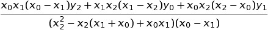

# Multi-Party-Computation
Demonstrations of the power of Multi Party Computation.

# Calculating the constant term in a polynomial
For a 2 degree polynomial <code>f(x)=ax2+bx+c</code>, in [Shamir's Secret Sharing method](https://en.wikipedia.org/wiki/Shamir%27s_Secret_Sharing), the idea is to encode a secret at `f(0)`. Hence, in our formula, the secret is the value `c`.

Now, given three equations, we have 3 unknowns, `a, b, c`. Finding the unknown `c` is solving these equations for the unknowns. 

Say the three equations are:

<pre>
a2x02+a1x0+a0

a2x12+a1x1+a0

a2x22+a1x2+a0
</pre>

A little pen and paper gives the formula to find <code>a0</code> as:

