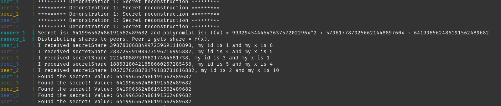
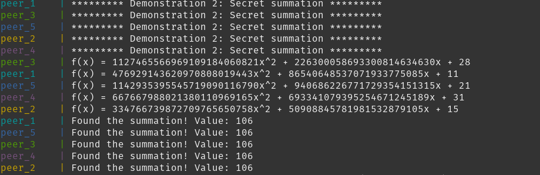
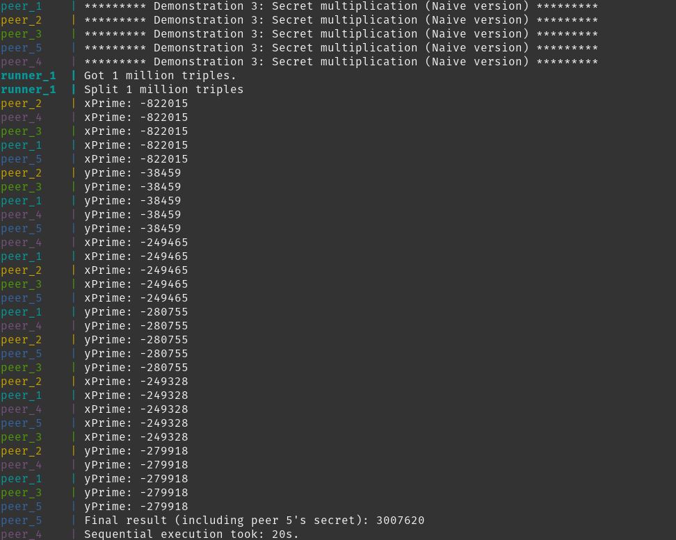
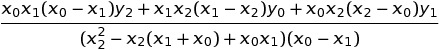

# Multi-Party-Computation
This repository contains code for demonstrating [T-Over-N Secret Sharing](https://en.wikipedia.org/wiki/Shamir%27s_Secret_Sharing).

## What does that mean?
Secret sharing is an idea that allows a secret to be broken down into multiple parts and shared to multiple nodes. The beautiful feature it has is that if a secret is broken into n parts and given to n parties, only t(<=n) parts are required to reconstruct the original secret. This is a very powerful idea, and it even allows operations like addition and multiplication on these parts (such that if you split multiple secrets into multiple parts, and add the parts, the original secrets get added too).

## How to run this code
Running this couldn't be easier.
- Install docker and docker-compose.
- `git clone https://github.com/a3y3/Multi-Party-Computation && cd ./Multi-Party-Computation`
- `docker-compose up --scale peer=5 --build`

## Making sense of the output
Now that you've run the code, what does the output mean?

(Note: Images might not represent the state of the repo you clone)
+ 
  - Runner creates a random secret `64199...9682` and a random polynomial `f` such that `f(0)=secret`.
  - Runner creates shares for the 5 peers (1->5) by finding `f(i)`, where `i` is the `ith` peer.
  - The peers receive the corresponding shares, then use reconstruction to reconstruct the original secret.

+ 
  - All 5 peers have their own private values (11, 15, 28, 31, 21 for peer 1 to peer 5)
  - Each peer creates a random polynomial to encode their secret.
  - Each peer creates and distributes shares for that polynomial.
  - Each peer locally adds up the shares.
  - Each peer uses reconstruction to reconstruct the added values and lands up with the addition of all secret values (11+15+28+31+21=106)
+ 
  - Each peer still has the same private values above.
  - Ignore xPrime and yPrime (those are values for using Beaver Triples, a method for multiplication, which is too complicated to write about in this README)
  - Peer 5 at the end uses reconstruction to get the multiplied value (11x15x28x31x21=3007620)
+ The last output is similar to output 3.

## Calculating the constant term in a polynomial
For a 2 degree polynomial <code>f(x)=a2x2+a1x+a0</code>, in [Shamir's Secret Sharing method](https://en.wikipedia.org/wiki/Shamir%27s_Secret_Sharing), the idea is to encode a secret at `f(0)`. Hence, in our formula, the secret is the value a0.

To reconstruct the secret, we need atleast 3 values of `f(x)`. Say 3 peers share their values to each other, then we have 3 equations (f1, f2 and f3) and  3 unknowns (a2, a1 and a0).
Finding the secret, the unknown a0, is solving these equations for the unknowns. 

Say the three equations are:

<pre>
y0=a2x02+a1x0+a0

y1=a2x12+a1x1+a0

y2=a2x22+a1x2+a0
</pre>

A little pen and paper gives the formula to find <code>a0</code> as:

